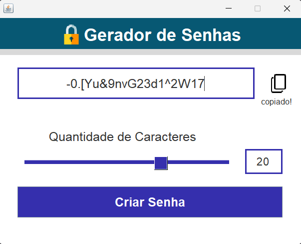

# 🔐 Gerador de Senhas

## 📜 Descrição

Este simples projeto consiste em um gerador de senhas aleatórias baseando-se na preferência do usuário. O projeto fornece uma interface gráfica do usuário (GUI) utilizando a biblioteca Swing do Java.

## ⚙️ Funcionalidades

- Personalização do comprimento da senha.
- Botão para copiar a senha para a área de transferência do sistema.

## 🗃️ Estrutura do Projeto

- `src`: Contém os arquivos fonte do projeto, e também a classe principal `App.java`.
    - `generator_password`: A classe `GeradorSenha.java` tem a função de gerar senhas aleatórias.
    - `gui`: Nesta pasta estão as classes que criam e gerenciam a interface gráfica, bem como os ícones utilizados.

## 📝 Como Executar o Projeto:

1. Certifique-se de ter o ambiente de desenvolvimento Java instalado em seu sistema.
2. Clone ou baixe o repositório do projeto em sua máquina local.
3. Abra o projeto em seu IDE Java favorito (como Eclipse, IntelliJ IDEA ou NetBeans).
4. Compile e execute o arquivo `App.java` para iniciar o aplicativo.

## 📸 Screenshot

  

